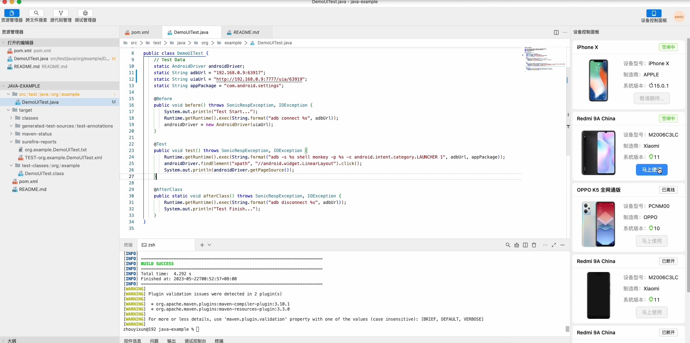
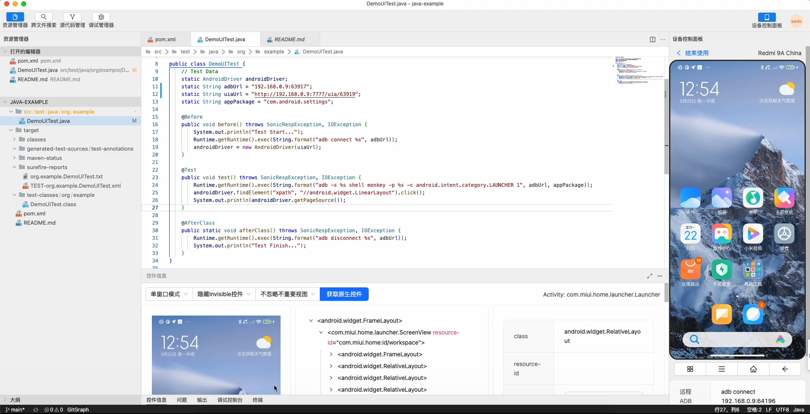

  

🎉Sonic IDE Desktop. Sonic IDE桌面版

  
  

## Document / 官方文档

See [Here](https://sonic-cloud.cn/ide/re-ide.html)

## Screenshot / 部分截图

## About source code / 关于源码

The IDE is still not fully functional at present. We are currently open to the public as an internal beta version, and the code is temporarily not open to the public. We promise to keep it free and there will be no theft of user information or embedding behavior in the code. We only have one link to obtain the latest version https://sonic-cloud.cn/ide.json For testing the latest version, we also plan to make the source code public when v1.0.0 is released. 

IDE目前功能仍然不齐全，我们目前作为内测版本对外开放，代码暂时不对外开放。我们承诺一直保持免费，并且代码内不会有任何窃取用户信息或埋点行为，我们只有一个获取最新版本的链接 https://sonic-cloud.cn/ide.json 用于检测最新版本，我们也计划将在v1.0.0发布时公开源码。
